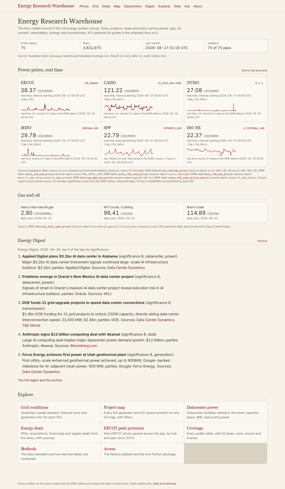
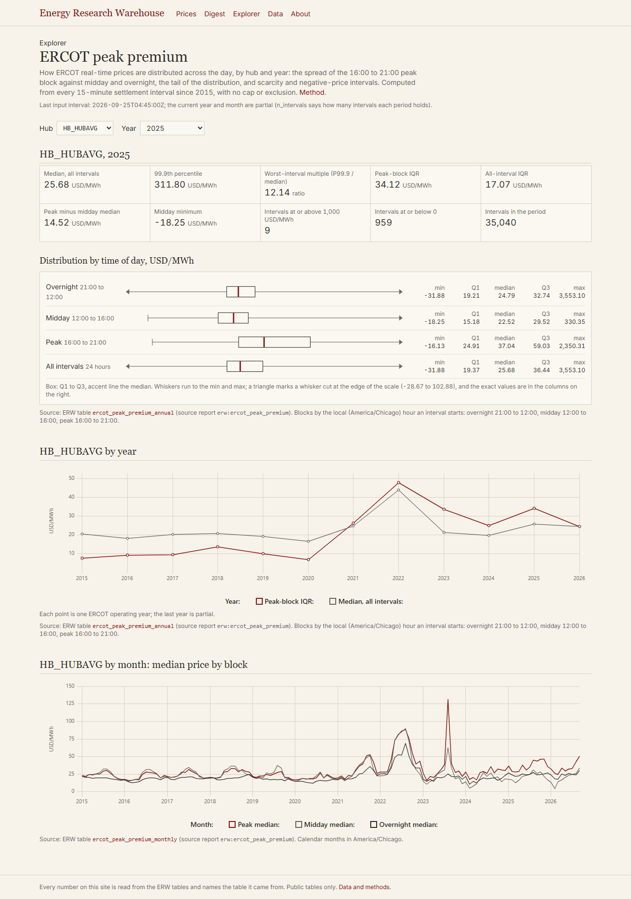
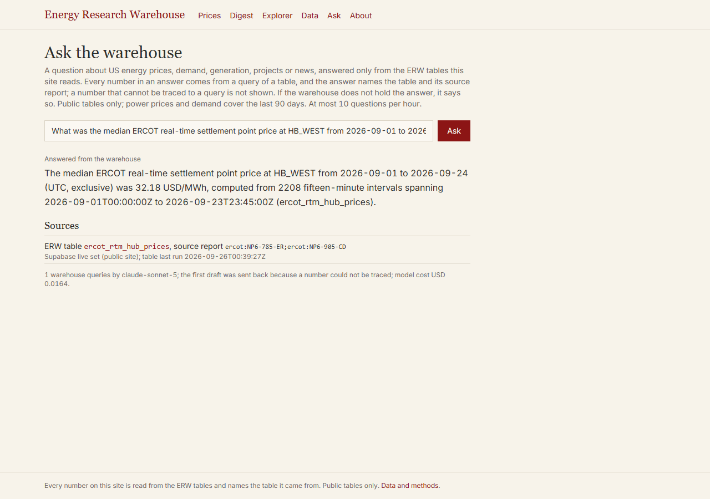

# Energy Research Warehouse (ERW)

The Energy Research Warehouse is the live, citable record of the US energy system: prices, flows, projects, deals and policy across power, natural gas, oil, nuclear, renewables, storage and transmission, with the global prices and events that move US markets included. AI's demand for power is the sharpest current lens on that system, not its boundary. Coverage is US first, world later. Every source is reshaped into three standard table shapes (series, entities, events), and every row names the report it came from and when it was retrieved.

**The site: [erw-flame.vercel.app](https://erw-flame.vercel.app)**. Live prices from six ISOs, the daily Energy Digest, every public table with its source, the ERCOT peak-premium explorer, and questions answered from the tables.

| | | |
|---|---|---|
|  |  |  |
| The price board | The ERCOT peak-premium explorer | A question answered, with its sources |

**For reviewers: [`docs/OVERVIEW.md`](docs/OVERVIEW.md)**, the platform on one page (generated from the repository's files: counts, pages, live tools, schedules, evaluations, open gaps).

## What is in it

As of 2026-09-26: **81 tables, 3,751,828 rows**, of which 75 tables (3,629,472 rows) are public. The daily run keeps these numbers current in [`STATUS.md`](STATUS.md); every table is listed in [`docs/coverage.md`](docs/coverage.md).

| Family | Tables | Rows | From | License |
|---|---|---|---|---|
| ISO hub and zone prices, day-ahead and real-time, last 30 days | 12 | 120,744 | 2026 | public |
| ERCOT hub prices, one table per year since 2015 | 24 | 3,063,570 | 2015 | public |
| Derived: ERCOT peak premium by hub, year and month | 2 | 25,704 | 2015 | public |
| Hourly demand and generation by fuel (EIA-930), 7 ISOs and the Lower 48 | 16 | 70,872 | 2026 | public |
| Oil, gas, products, LNG and retail electricity series (EIA) | 10 | 277,587 | 1920 | public |
| Spot and commodity prices via FRED | 2 | 26,366 | 1986 | 1 public, 1 internal |
| Generators: operating, planned, retired (EIA-860M) | 3 | 31,170 | snapshot | public |
| Interconnection queues of six ISOs | 6 | 14,567 | snapshot | public |
| Scored energy news stories | 2 | 1,934 | 2026 | 1 public, 1 internal |
| Capacity, carbon and shipping (PJM, CARB, RGGI, PortWatch) | 4 | 119,314 | 2007 | internal |

Not in it yet: PJM energy prices, SPP real-time series, futures, lithium and other battery metals, equities, datacenter records and structured deals.

## Use it

The `erw` Python package reads the tables. From a clone, with no API key (ERCOT publishes without one):

```bash
git clone https://github.com/SamuelEnrique/erw.git && cd erw
pip install -r requirements.txt && pip install -e package
python warehouse/connectors/iso_prices.py ercot --days 3
python -c "import erw; print(erw.fetch('ercot_dam_hub_prices', node='HB_NORTH').tail())"
python -c "import erw; print(erw.cite('ercot_dam_hub_prices'))"
```

The tables themselves are not in git. A clone holds the news tables, and makes the others by running their connectors (`bash warehouse/run_daily.sh` runs them all; EIA needs a free API key). Every table, with full history, is on Redivis: [`energy_research_warehouse`](https://redivis.com/datasets/05yh-65frzyhaz), open once its first version is released by a human. The package also reads Redivis and the site's Supabase live set (`ERW_BACKEND`, see [`package/README.md`](package/README.md)). For AI assistants, [`package/llms.txt`](package/llms.txt) says which table answers which question.

## How it refreshes

- **Daily, 14:00 UTC** ([`.github/workflows/daily-prices.yml`](.github/workflows/daily-prices.yml), the steps in [`warehouse/run_daily.sh`](warehouse/run_daily.sh)):
  1. restore the rolling-window tables from the Redivis draft;
  2. run every connector for the last three days, merging into the tables;
  3. ingest and score the news;
  4. run the validator (a blocked table stops the run);
  5. rebuild coverage and load the Supabase live set;
  6. write the Energy Digest and `STATUS.md`;
  7. upload the changed tables to the Redivis draft, and commit the metadata.
- **Every 15 minutes** ([`.github/workflows/latest-prices.yml`](.github/workflows/latest-prices.yml)): the newest real-time price for each ISO hub and zone, to the site's price board.
- **Completeness:** a market is written only when every node has every interval (per day, for sources with occasional holes), and each gap is recorded. Nothing is filled or estimated.
- **Releases:** nothing is released on Redivis without a human reviewing the draft.

## License rule

Every table is `public` or `internal`. Internal means the source licenses it for internal use only (PJM data, CARB and RGGI auction results, IMF series via FRED, PortWatch, and the third-party text of news stories). Internal tables stay in the warehouse and are never shown on the site or redistributed. A derived table takes the most restrictive license of its inputs. Cite the organization that published the data, then the ERW table: `erw.cite(table)` writes the citation.

## Lineage

The ERW is modeled on the [Item Response Warehouse](https://github.com/ben-domingue/irw) (IRW) of Ben Domingue and colleagues at Stanford ([itemresponsewarehouse.org](https://itemresponsewarehouse.org)). Its owner allowed the ERW to copy its infrastructure and documents. The ERW took from it:
- one standard long-table format, and a validator every table must pass;
- a provenance header on every table;
- a versioned store of record on Redivis that only a human releases;
- the `erw` package, modeled on the IRW's Python package;
- `llms.txt`, and the rule that a fact lives in one place.

The ERW is built as a Stanford independent study.

## Documents

| Read | For |
|---|---|
| [`ARCHITECTURE.md`](ARCHITECTURE.md) | How a dataset travels, and which document wins |
| [`CLAUDE.md`](CLAUDE.md) | The stack, the non-negotiables, the repository layout |
| [`docs/datastandard.md`](docs/datastandard.md) | Table shapes, columns, units, names |
| [`docs/OVERVIEW.md`](docs/OVERVIEW.md) | The platform on one page, for reviewers (`warehouse/metadata/build_overview.py`) |
| [`docs/platform-tools.md`](docs/platform-tools.md) | The platform's tools (25 since session 19) and their status |
| [`STATUS.md`](STATUS.md) | Tables, last runs and open gaps, regenerated daily |
| [`PRIORITIES.md`](PRIORITIES.md) | What kind of work comes first |

## Session log

The ERW is built in sessions, each with its prompt and a report of what was built, decided and left open.

| Session | Date (UTC) | Built | Report |
|---|---|---|---|
| 1 | 2026-09-24/25 | The repository, data standard v0, validator, and the first connector (ERCOT prices) | [report](SESSION_1_REPORT.md) |
| 2 | 2026-09-25 | Prices from six ISOs in one connector; validator checks for geography and interval alignment | [report](SESSION_2_REPORT.md) |
| 3 | 2026-09-25 | The daily GitHub workflow, idempotent merges, generated coverage, the add-a-connector skill | [report](SESSION_3_REPORT.md) |
| 4 | 2026-09-25 | The `erw` Python package and `llms.txt`, the briefing for AI assistants | [report](SESSION_4_REPORT.md) |
| 5 | 2026-09-25 | EIA-930 demand and generation, EIA fuel spot prices, run history and the license rule | [report](SESSION_5_REPORT.md) |
| 6 | 2026-09-25 | News: 44 feeds, scoring with the Claude API, the daily Energy Digest | [report](SESSION_6_REPORT.md) |
| 7 | 2026-09-25 | News rulings; EIA products, retail and LNG series, PJM capacity, carbon auctions, FRED | [report](SESSION_7_REPORT.md) |
| 8 | 2026-09-25/26 | Generators (EIA-860M), interconnection queues, ERCOT history from 2015 | [report](SESSION_8_REPORT.md) |
| 9 | 2026-09-26 | Tables leave git; the ERCOT peak premium method and derived tables | [report](SESSION_9_REPORT.md) |
| 10 | 2026-09-26 | Redivis as the store of record (draft), Supabase live set, 15-minute latest prices | [report](SESSION_10_REPORT.md) |
| 11 | 2026-09-26 | Supabase loaded; the public site (Next.js) with prices, digest, data and the explorer | [report](SESSION_11_REPORT.md) |
| 12 | 2026-09-26 | Question answering over the warehouse (`/ask`), with a 30-question evaluation | [report](SESSION_12_REPORT.md) |
| 13 | 2026-09-26 | Briefing rewrite, per-day backfills, per-table hashes in the loader, a tool fix | [report](SESSION_13_REPORT.md) |
| 14 | 2026-09-26/27 | CI secrets check and a runner-coverage fix, ISO-NE hourly per-day, this README, STATUS.md | [report](SESSION_14_REPORT.md) |
