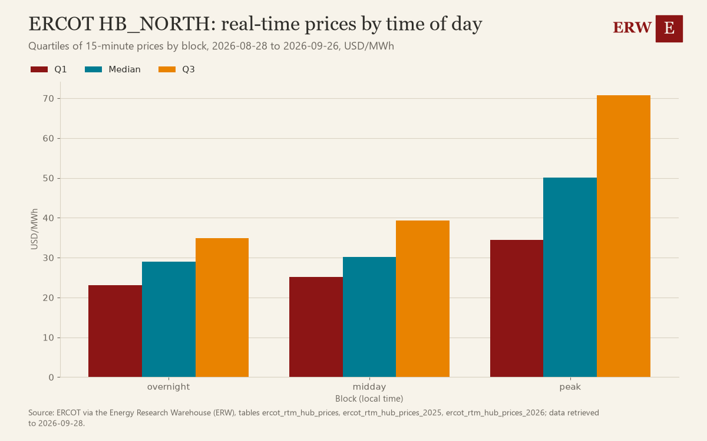

# Energy Roundup, 2026-W39

The ERW's weekly roundup of energy news for 2026-09-21 to 2026-09-27, from 1015 scored stories.

## Weekend

1. **TotalEnergies announces final investment decision for Absheron field development in Azerbaijan** (gas, 1 story)  
   A final investment decision on a major gas field is a market-moving supply commitment. Sources: [Financial Times](https://news.google.com/rss/articles/CBMipgFBVV95cUxOdk9VLUIwUHoxQ19TZVktcGdJcEtKekFGU25mUWx6R0JHUGw2blFKaU9lb01sWUg0cE9NQ3RGaTJVcTgzUlpaT0NzTm9RaGIxaWY2R1pzcjBtamE4aVd0eF9jdGpPRFkzRktuTEQtdFpSa0lzOGM1RTRVWnNLcVp0WUhuTXN0X3l6UjFqTWFlMGZNZm9sOW5vRFZNOG81TUVEZEJBOEVR?oc=5)
2. **EPA power plant rollback would add 123 million more tons of CO2** (policy, 1 story)  
   Federal deregulation removing emissions limits reshapes coal and gas plant economics nationwide. Sources: [OilPrice.com](https://oilprice.com/Energy/Energy-General/EPA-Power-Plant-Rollback-To-Add-123-Million-More-Tons-of-CO2.html)
3. **Global gas supply squeeze could last through next summer** (gas, 1 story)  
   Prolonged tight gas markets threaten Europe and Asia winter demand and pricing outlook. Sources: [OilPrice.com](https://oilprice.com/Energy/Natural-Gas/Global-Gas-Squeeze-Could-Last-Through-Next-Summer.html)

## The five stories of the week

1. **Oracle triggers force majeure on data center project over power delays** (datacenter power, 4 stories)  
   Oracle invokes force majeure over power delays, direct evidence of grid constraints hitting AI datacenter buildout. Sources: [Reuters](https://news.google.com/rss/articles/CBMivgFBVV95cUxNbWZqSDVjdjZZaURFZ3VZNzlrRzdIZzE1MDRPNkNlQjRsbmlzLWdzUTRqTEFVdnNCS1czRkNrbVZTbzFHa1B2Nm51ZWRKSUUxMm41M05DWWw5WlQwZWhsR0duLVMzS1lXekZ1enFyS0VpcHRUTTduUVZtVnhXRDZRTVpHN0ZfUnhjUVVCbkNMeTAtZHdmOVpwUXpyZDNDY00zRVVyM1dyVG5fMTJ6RzE5XzBFTHU2YTNtMDdmdjh3?oc=5), [Financial Times](https://news.google.com/rss/articles/CBMihAFBVV95cUxPRnZrNVVKTGFRazBJWHdDXzMwYnM0dWp2SUlhcENBS09rTnAxOGpwSkN2NzBfemtQZ0l0RG1JcEluYWh6enZlLXdqRVBXRWMxR2xuLXBtbWF1X2w4RFFUOGp6SHlxZ2ZUMU5UVml1MFdEYl9ydTl3LS14OXVocTBCbENLMUc?oc=5), [WSJ](https://news.google.com/rss/articles/CBMixAFBVV95cUxQak1fNEtRazdLRG9WYzhfZWtLMENrWWhDSnhQOFlvd1VmMHZlVTVYVWQtSmFvazc2V2Z1TFlEWVZpcHhjT0lFWGVvVTV6MTk4UG13cFJvY1VqY2FxVUFmbGhiZTZPY1hpem9IYkhsM1VNaDZMYUJQWU5kQzE4Z2NkbVhQMVNRWTRNcXZ2eWRKSGF1VEhnaW51bG9VM0xwQk1lWlFiUDc0TldJdThrUkY3VHdJYVQ4d01TZENHN0dNTFdlTzdi?oc=5)
2. **Applied Digital reveals $3.2bn Delta Forge 2 AI data center for Alabama** (datacenter power, 1 story)  
   Major $3.2bn AI data center investment signals continued large-scale AI infrastructure buildout. Sources: [Data Center Dynamics](https://www.datacenterdynamics.com/en/news/applied-digital-reveals-32bn-delta-forge-2-ai-data-center-will-be-built-in-alabama/)
3. **DOE unveils $1.9B funding for 31 grid upgrade projects adding 23 GW capacity** (transmission, 5 stories)  
   Major DOE transmission funding adds 23GW capacity, significant grid expansion signal. Sources: [Utility Dive](https://www.utilitydive.com/news/doe-advanced-transmission-projects-spark-funding/831259/), [Data Center Dynamics](https://www.datacenterdynamics.com/en/news/doe-unveils-19bn-in-funding-for-31-grid-upgrade-projects-to-speed-data-center-connections/), [T&D World](https://www.tdworld.com/overhead-transmission/news/55407902/does-525b-spark-grid-initiative-selects-31-us-projects-to-accelerate-transmission-infrastructure-upgrades)
4. **Anthropic strikes $12 billion cloud computing deal with Akamai** (deal, 4 stories)  
   Large AI computing deal implies major datacenter power demand growth. Sources: [Bloomberg.com](https://news.google.com/rss/articles/CBMiswFBVV95cUxQbEpHV0VXek9XWS1oa2ViR2ZBZ2d0ZERxdXdBaU1yRlB1aFQySTAxQUtmeV9CTk9qMm01eldSTWJ2MDVqQVFjdTNuS3RQUWZpRi1ycGNLTEs4a1FZMUsyVmt6dmtyZmc4cm14NkV2QkoxRjdITUFmbGJVbkF0c2hJajBZUzRFUWFTNE53bEg0MndlSEl0cmdHRXhkOUN4UXA4RXp1dVdRZkYySTBFRmRkMUl5TQ?oc=5), [Reuters](https://news.google.com/rss/articles/CBMiogFBVV95cUxNanVpUjFYbXpXWHdEU1NlRFlfZnI5a0Y2OVlzYUkya2tBR3hOY05ZTk05ZVZrWUZqcmttYjV3b2x6d01iTUFIZ095a1lQbkFCbTZFVGJzd2tUM1NkcWtOV3B2X1VpMGpkSVlGOW13ZU0xd3BjUm1paldVNHpYVllpN0UwQ3ZkUGk0R3AtaWx3SDJFaXdEUkdmeHRlT3M0Tk10LWc?oc=5), [WSJ](https://news.google.com/rss/articles/CBMiuwFBVV95cUxOVW0zbElYMzI3cUlNNWR0Rnp5Wk5FQTBJa3l4WFZ5RU01SjBJMWFCNWtWY01zcWl6TGlpalpDdjFmTGwtcUdQYVMzc1ZHOENwQ01LbmRPUS15T3lsY1JZSjgwTUxQLUNXZmhtT19KbUFLYnhZclF5SHNTNmVOUm1LTGlSNGhUTmVqdGNxQ3cyeXBoQ19NeHVsU09mY3VGbHZmVUtyVDAtdG1NancxTmdKUjIzcjh5aTViRGVn?oc=5)
5. **Amazon commits $2.4 billion initial, up to $8 billion, for Generac backup generators** (datacenter power, 1 story)  
   Amazon commits up to $8B for backup generators, highlighting AI data center power constraints. Sources: [Data Center Frontier](https://www.datacenterfrontier.com/energy/article/55407678/amazon-generac-deal-puts-backup-power-in-the-ai-infrastructure-spotlight)

## Deals of the week

| Date | Type | Buyer | Seller | Asset | MW | US dollars | Status | Story |
|---|---|---|---|---|---|---|---|---|
| 2026-09-24 | debt | not stated | Hoegh Evi | Hoegh Evi | not stated | 1,850,000,000 | closed | [1](https://lngprime.com/asia/hoegh-evi-wraps-up-1-85-billion-refinancing/197369/) |
| 2026-09-24 | project_finance | US EXIM | YPF | Argentina LNG project | not stated | 6,000,000,000 | announced | [1](https://lngprime.com/americas/us-exim-to-back-ypfs-argentina-lng-project/197405/) |
| 2026-09-24 | equity_raise | not stated | Rune | Rune | not stated | 40,000,000 | closed | [1](https://pv-magazine-usa.com/2026/09/24/rune-raises-40-million-series-a-to-build-on-site-off-grid-ai-data-centers-at-solar-facilities/) |
| 2026-09-24 | joint_venture | Samsung C&T | Kairos Power | Hermes 2 demonstration plant | not stated | 100,000,000 | signed | [1](https://www.ans.org/news/2026-09-24/article-8431/kairos-and-samsung-ct-partner-up-on-hermes-2/) |
| 2026-09-24 | ppa | Targa Resources | ProPetro | not stated | 230 | not stated | signed | [1](https://www.rigzone.com/news/propetro_to_supply_230_mw_to_targa-24-sep-2026-184697-article/?rss=true) |
| 2026-09-24 | offtake | Amazon | Generac | backup generators | not stated | 2,400,000,000 | signed | [1](https://www.datacenterfrontier.com/energy/article/55407678/amazon-generac-deal-puts-backup-power-in-the-ai-infrastructure-spotlight) |
| 2026-09-24 | offtake | Anthropic | Akamai | cloud services | not stated | 11,600,000,000 | signed | [1](https://news.google.com/rss/articles/CBMiogFBVV95cUxNanVpUjFYbXpXWHdEU1NlRFlfZnI5a0Y2OVlzYUkya2tBR3hOY05ZTk05ZVZrWUZqcmttYjV3b2x6d01iTUFIZ095a1lQbkFCbTZFVGJzd2tUM1NkcWtOV3B2X1VpMGpkSVlGOW13ZU0xd3BjUm1paldVNHpYVllpN0UwQ3ZkUGk0R3AtaWx3SDJFaXdEUkdmeHRlT3M0Tk10LWc?oc=5) |
| 2026-09-25 | fuel_supply | Vietnam refinery | ExxonMobil Asia Pacific | crude oil | not stated | not stated | signed | [1](https://news.google.com/rss/articles/CBMiugFBVV95cUxNTjJQTG1ib2plSnVBWnVaN1V6c3o3UGFuaThiZ0hKNnZieW5BbkVjVDFRQnlkWmtRbHdJdHJBT0NWTmNMVF9tLVoyTFlqcVJwOUNaUXZHZ09FUTdreEh1TVVCWWlMUWxjek5OX0VKalBsRW9fWW53aXc5dEp2Rm9xRGdXam14eHBQdi1YVllFSHFqQXB0WXNfYUMyX1RaMWJZVld0UHNOVzNOdlRwaFM3OTdHSTJuQ1A2a2c?oc=5) |
| 2026-09-25 | m_and_a | ESR | Aquila Clean Energy APAC | Aquila Clean Energy APAC | not stated | not stated | signed | [1](https://www.energy-storage.news/esr-to-acquire-aquila-clean-energy-apac-in-asia-pacific-renewables-and-energy-storage-consolidation/) |
| 2026-09-25 | other | Eni | not stated | Sapukala block | not stated | not stated | closed | [1](https://lngprime.com/exploration/eni-wins-indonesian-block/197424/) |
| 2026-09-25 | debt | not stated | Golar LNG | senior notes offering | not stated | 500,000,000 | announced | [1](https://lngprime.com/americas/golar-to-raise-500-million-via-notes-offering/197454/) |
| 2026-09-25 | m_and_a | Inpex | Jera | Ichthys LNG project stake | not stated | not stated | not stated | [1](https://lngprime.com/asia/inpex-exercises-right-to-buy-jeras-ichthys-lng-stake/197479/) |
| 2026-09-25 | debt | Mercuria | Zambia Power Trader | not stated | not stated | 250,000,000 | signed | [1](https://news.google.com/rss/articles/CBMisAFBVV95cUxNS3BnTHVkY1EwMXJ3VlBwN25EU0hTYngwclZyazRHMmxDRVdMZ21sZ2N1UnlXaE8tQ3RoZjZ4akVhZkJyNnU1dmR2RWdxLXZHRUhodUNSMDJrZjFxYTNBQWVNeU5XNVJmSzVBbGFuQXQ2aVJqUFZQS2R4Q0JZSVBMS0MtTmo0OHN3cVhhRHJtSFF3SENCcGtXU1JuNVlnRlF1eUtyNUlxQmRmT0k2NnB0cQ?oc=5) |
| 2026-09-25 | m_and_a | Eaton | COL Group | COL Group | not stated | not stated | signed | [1](https://news.google.com/rss/articles/CBMipgFBVV95cUxOZTZEWmVYeE13V3NsVjhzRWtEc3NGV3pwX2R1S3dtcEgwMVFSZnk2NGVQbkRJbnJOUUVLcm56Uzlib2RkRWEwMzRNMTExNkp0UEFVTnJfR1M0RTc4ejRwek1GOWRFWVRmU1dpWXhuTE94MHJXS25wOWtUeVY3YUdGLWU3OWEwMExRa2RINWZWRW1mWnM1cldhZXg5dHNMWENIWXFqMmhB?oc=5) |
| 2026-09-25 | other | a Leading Frontier AI Lab | Atlas Energy Solutions | not stated | not stated | not stated | announced | [1](https://news.google.com/rss/articles/CBMipgFBVV95cUxQYlJEU1doOU9URTY1djRVNlQ1S3pwSFpXemduSmdKR1huS1lKb0Q3YnFhSEhjd0Z0aFFmcl8tT2pPaEktRDBSSDlkcExXS3FPd3dXZ0FiUjY2Rm9ka0RCVHIwRi0wd1Q1X2xKT1JEcE10ZHZ0MjhlV1E0ZGktaW5jaTlqT3VVVnBaU2h2cXd0WXEyblNlQ3ZTTlZmZmplNTdnc3ZSUHRn?oc=5) |
| 2026-09-25 | equity_raise | Third Point | Nscale | Nscale | not stated | 3,360,000,000 | closed | [1](https://news.google.com/rss/articles/CBMiswFBVV95cUxOZ183TmVpcmtqUDQxay1ZbFlKWEUzdjZPUkk3NHVNX2dKQnBaQkhoYVF3ZURZbUZZLXVTNG1NUmFUUDkxV2t1UzhieV9HUi1ONHZsZk5UNDVsbWdvSXFnTzR4dW1mTF9lcHFhQlk4My0wOWdBN1MzV2tna0hMVmU4czZkdDhuZVlUZ0wwRFdrbkpDT3I3OTVrV3RXblJvMDVkcDRVSXVZdG0zemdISFdCNmkxRQ?oc=5) |
| 2026-09-25 | fuel_supply | oil and gas operators in the United States Gulf Coast, Midwest and Rockies | Spiritus | CO2 supply for EOR | not stated | not stated | signed | [1](https://www.rigzone.com/news/spiritus_secures_preliminary_deals_to_supply_co2_for_eor-25-sep-2026-184704-article/?rss=true) |
| 2026-09-25 | m_and_a | WhiteHawk | not stated | Appalachia, Haynesville Gas Assets | not stated | 111,800,000 | closed | [1](https://www.rigzone.com/news/whitehawk_completes_acquisition_of_appalachia_haynesville_gas_assets-25-sep-2026-184705-article/?rss=true) |
| 2026-09-25 | m_and_a | Genel Energy | Capricorn | Capricorn | not stated | 436,000,000 | not stated | [1](https://news.google.com/rss/articles/CBMizAFBVV95cUxNb192V2o1c1ZUempDM0M3VkR0cmhwOW9iVEFmTC1ZNWktT2plLVo3UHh6bmNud1dFVGE5cGE4TXE2LVQ5RG44YjRrb0ZpbkZtVkdaNU5sSFQ3U09CS1JSOWpJVkpOOV8ySGZRYVk0SXhmenltblFacU1wbndjQmVTZ2RlYXRsMmZXM0VzY1NqTVowTktOWGpWMGktaHAyZ0xLbzBkUjhtbnNzU2M5SXlWZElvOS1wVEQ5cHJiT3FIc2hYX2xQLUt2Q21mbFk?oc=5) |
| 2026-09-25 | m_and_a | BP | Devon Energy | Devon's Eagle Ford business | not stated | not stated | cancelled | [1](https://oilprice.com/Latest-Energy-News/World-News/BP-Eyes-Bigger-US-Shale-Footprint-After-Devon-Deal-Talks.html) |
| 2026-09-25 | joint_venture | Polskie Elektrownie Jądrowe | Bechtel-Westinghouse consortium | Poland's first nuclear power plant | not stated | not stated | not stated | [1](https://www.ans.org/news/2026-09-25/article-8437/european-new-nuclear-italian-revival-polish-agreement-parisian-summit/) |
| 2026-09-25 | other | not stated | not stated | offshore gas project | not stated | 800,000,000 | announced | [1](https://news.google.com/rss/articles/CBMivAFBVV95cUxPUm5zN1BNLUJCSmpBTmsxbEIxNHR0bThaVHdLOFJzdFdMMGNmRE9OaWg0cFExWW04ekhtaEdBUU0wRUx6bnhLd2tGaDNJWlVfTUg4cDRaem9KUEdiNkVnaDdHa2xYLUtQODhWUDFCamhjOElhR0x0RWJTaWpaeTV0NzZ1M2NpbVVYWW1pTk5GTmZNajZMRkwzWnJEbEFURF9ycUVONE04Nlk1ZTluWGtiNnNqQ3BsUzB2dFBEMQ?oc=5) |
| 2026-09-26 | m_and_a | Shell | Talos | Gulf assets | not stated | not stated | closed | [1](https://news.google.com/rss/articles/CBMiZ0FVX3lxTE9iUjRRS0NBWTJiYkw1dkR3V2tIVzItVzV4a21MUllXY2RyenJ0UkpSYzRYaWlJSkQ2RUI3d2RNY0d5U1NRQmE3b1U2RVdwdUR1NHk1WjUwZmItT1otaW9OOHBzNW43Rm8?oc=5) |
| 2026-09-26 | joint_venture | not stated | not stated | Azerbaijan Gas Project | not stated | not stated | announced | [1](https://news.google.com/rss/articles/CBMirgFBVV95cUxPdFdRdy1rUWZWZU1lNkdxZ2ZfVlpjN3lDSHhyNFNGX0JCNWlLN3JQcm9LaWlmRXA2RU9mSEN5N0NtUXI3SWhkR3FkTjZHV3pRZ2ZrVzBxbHduUzZjV2RWejJjNm5sSXRkekljUmt0YmJlRHdqcE94SVJ6S0daUGRjazVQMDNNQzlHRUFxdXBnNVhvQUUtNENTUHN0YUEyaGRnQ2thNi1rY1JxNFdqY3c?oc=5) |
| 2026-09-26 | other | not stated | TotalEnergies | Absheron Full Field Development | not stated | not stated | announced | [1](https://news.google.com/rss/articles/CBMipgFBVV95cUxOdk9VLUIwUHoxQ19TZVktcGdJcEtKekFGU25mUWx6R0JHUGw2blFKaU9lb01sWUg0cE9NQ3RGaTJVcTgzUlpaT0NzTm9RaGIxaWY2R1pzcjBtamE4aVd0eF9jdGpPRFkzRktuTEQtdFpSa0lzOGM1RTRVWnNLcVp0WUhuTXN0X3l6UjFqTWFlMGZNZm9sOW5vRFZNOG81TUVEZEJBOEVR?oc=5) |
| 2026-09-26 | fuel_supply | China | not stated | coal | not stated | not stated | announced | [1](https://news.google.com/rss/articles/CBMisgFBVV95cUxOUXVPZTZ1QnpkM01VelF4WWtydjg0QlplcHVJZzE1aHE0RDNpeVQ3V21UeUhnNTRiNFJWdWNnOFpxa05LckYwYldqbjZBNV9pd3lydG9aNUExZWMzUW9nV3V0aVNQZXRzUmhnNl9pdEQ4SV9acVVjTVFxMEdqd1NCbjhJVmY3UW15WGpvdkJTRVRnblcwSUYwQ2w0ejlmcWw4cF9YRW8tMVMwS1FlQ2VoNnlB?oc=5) |
| 2026-09-26 | other | Exxon | Azerbaijan | Middle Kura Basin | not stated | not stated | signed | [1](https://news.google.com/rss/articles/CBMisAFBVV95cUxPa0M2MXplcllFNmtyTWN1NEVJbm1WdTJFWWhXVDlxQ1ZzZExTb0duSHBCMDhwbl8wNXVjcEFGYmd3TUw2OEdPU3lmZzhtTFJyb2xyZEIwUmtpemdkSTFKb3VWNGNBX25ucU1kU1BBY1FONmJjYnR2TlhyRnc0QllDelFlbm1TeGk0SkIzdUMwUVpGVmd6bG0yVHFwb2I4ODRqWmNKdVBmS0x1NlBPWEI0Tw?oc=5) |

Table: `energy_deals` (27 deals; extracted from the scored stories by `warehouse/deals/extract.py`, every number checked against its story).

## Datacenter announcements of the week

| First reported | Operator | Site | Place | MW | Status | Story |
|---|---|---|---|---|---|---|
| 2026-09-24 | Oracle | not stated | NM | not stated | not stated | [1](https://news.google.com/rss/articles/CBMixwFBVV95cUxQRGxJcWpfYlZSczJLRGhOQmMxNnU2NXFhUzVDSmwtTlhJRW1CNjd2MTZWOXkwcWdQZzVqNnJSdnBDU0RoWEVFYzIxbVRtNlpwWElaVENIUm9GYXJSOUFIZGJLbFNHb1lydlVWX2ZHb1ZjVXo4MURMT3BfelREVWY2TTljZ0cxRHd6TlZ5eEJhMHgycEN4MjdlbjZISDVzNktvVkQydmx3bVdoOHdmbkpBRUpLX01YMWxwWHgzcWE5ZURnbEZhSGYw?oc=5) |
| 2026-09-25 | Applied Digital | Delta Forge 2 | AL | not stated | announced | [1](https://www.datacenterdynamics.com/en/news/applied-digital-reveals-32bn-delta-forge-2-ai-data-center-will-be-built-in-alabama/) |
| 2026-09-25 | Arevia Power | not stated | Ada County, ID | not stated | applied | [1](https://heatmap.news/plus/the-fight/hotspots/arevia-idaho-solar-data-center) |

Table: `datacenter_projects` (3 facilities; `warehouse/datacenters/extract.py`, every field only as its story states it).

## Numbers of the week

Day-ahead prices were highest at ERCOT's HB_NORTH (41.84 USD/MWh) and lowest at SPP's SPPSOUTH_HUB (33.96 USD/MWh), with ERCOT and CAISO edging up slightly while NYISO, MISO, SPP and ISO-NE all fell, MISO's INDIANA.HUB dropping the most at -34.92. The week's highest real-time price was 521.36 USD/MWh at N.Y.C. (NYISO). Fuel spot prices also declined, with Henry Hub natural gas down 0.07 to 2.90 USD/MMBtu, WTI crude down 5.03 to 96.41 USD/bbl, and Brent down 4.77 to 114.89 USD/bbl, while US48 peak demand reached 608,317 MW.

**Day-ahead average, main hub, over the ISO's local week, and the change from the week before**

| ISO | Hub or zone | This week USD/MWh | Week before USD/MWh | Change | Table |
|---|---|---|---|---|---|
| ERCOT | HB_NORTH | 41.84 | 39.90 | +1.94 | [1] |
| CAISO | TH_SP15_GEN-APND | 36.84 | 36.79 | +0.05 | [2] |
| NYISO | N.Y.C. | 39.36 | 45.97 | -6.61 | [3] |
| MISO | INDIANA.HUB | 40.45 | 75.37 | -34.92 | [4] |
| SPP | SPPSOUTH_HUB | 33.96 | 46.44 | -12.48 | [5] |
| ISO-NE | .H.INTERNAL_HUB | 36.12 | 44.30 | -8.18 | [6] |
| PJM | | | | | no PJM price table (no API key) |

**Highest real-time price of the week:** 521.36 USD/MWh at N.Y.C. (NYISO), interval starting 2026-09-25 18:45 local (2026-09-25 22:45 UTC), lmp_rtm_15m_mean [7].

**Fuel spot prices, weekly change** (EIA, trading dates; the last close of the week and the last close before it):

| Price | Last close this week | Last close before | Change | Table |
|---|---|---|---|---|
| Henry Hub natural gas | 2.90 USD/MMBtu on 2026-09-22 | 2.97 on 2026-09-18 | -0.07 (-2.4%) | [8] |
| WTI Cushing crude | 96.41 USD/bbl on 2026-09-22 | 101.44 on 2026-09-18 | -5.03 (-5.0%) | [8] |
| Brent crude | 114.89 USD/bbl on 2026-09-22 | 119.66 on 2026-09-18 | -4.77 (-4.0%) | [8] |

**US48 peak demand of the week:** 608,317 MW in the hour starting 2026-09-21 21:00 UTC (Monday 2026-09-21, 17:00 Eastern), from 168 hours of the week to 2026-09-27 23:00 UTC [9].

Tables: [1] `ercot_dam_hub_prices` (ercot:NP4-190-CD); [2] `caiso_dam_hub_prices` (caiso:PRC_LMP); [3] `nyiso_dam_zone_prices` (nyiso:damlbmp); [4] `miso_dam_hub_prices` (miso:da_expost_lmp); [5] `spp_dam_hub_prices` (spp:DA-LMP-SL); [6] `isone_dam_zone_prices` (isone:da_lmp_hourly); [7] `nyiso_rtm_zone_prices` (nyiso:realtime); real-time tables read, and how far each reaches this week: caiso_rtm_hub_prices to 2026-09-27 06:45 UTC, ercot_rtm_hub_prices to 2026-09-27 04:45 UTC, isone_rtm_zone_prices to 2026-09-27 03:45 UTC, isone_rtm_zone_prices_hourly to 2026-09-25 03:00 UTC, miso_rtm_hub_prices to 2026-09-27 04:00 UTC, nyiso_rtm_zone_prices to 2026-09-27 03:45 UTC, spp_rtm_hub_prices to 2026-09-27 04:45 UTC; [8] `eia_fuel_spot_prices` (eia:natural-gas/pri/fut, eia:petroleum/pri/spt); [9] `eia930_us48_demand` (eia:electricity/rto/region-data).

## Chart of the week

**ERCOT HB_NORTH: real-time prices by time of day**

At ERCOT HB_NORTH from 2026-08-28 to 2026-09-26, median real-time prices were 29.01 USD/MWh overnight, 30.11 USD/MWh midday, and 50.09 USD/MWh at peak. In the latest 7 days, 2026-09-20 to 2026-09-26, the peak minus midday median gap was 28.08 USD/MWh, a robust z of 2.46 against its own history.

Source: ERCOT via the Energy Research Warehouse (ERW), tables ercot_rtm_hub_prices, ercot_rtm_hub_prices_2025, ercot_rtm_hub_prices_2026; data retrieved to 2026-09-28. Template `peak_premium_block`; every template's latest run is on [/analysis](/analysis).

---

[How this is made.](/about#digest)

<!-- Generated by warehouse/news/roundup.py at 2026-09-28 08:55 UTC; run log warehouse/output/logs/news_roundup_20260928T085542Z.log; model claude-sonnet-5. -->
