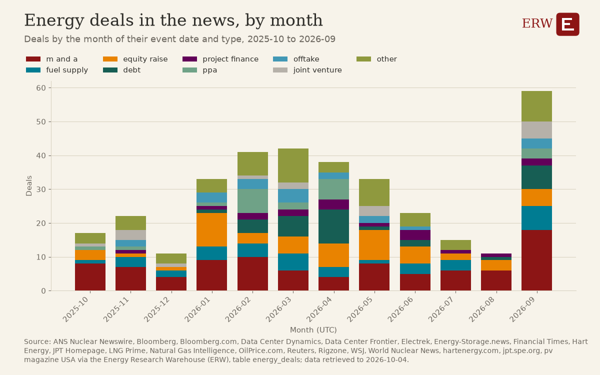

# ERW's Roundup, 2026-W40

ERW's weekly roundup of energy news for 2026-09-28 to 2026-10-04, from 1692 scored stories.

## Weekend

1. **G7 agrees to release 100 Million Barrels of diesel and crude from emergency stocks** (oil, 5 stories)  
   Coordinated stock release aims to ease a diesel crunch and affects crude and product price direction. Sources: [Bloomberg.com](https://news.google.com/rss/articles/CBMizwFBVV95cUxOeDZMa1pQNGE2bGtDMzd1Z05kRnZVX2VTbE5TWlk5aVZJUzlESHNHR3RjbUZwZV9idWQ4T3lvNTdxWnBxQ1h5NzY4elRRZjBubFhrazA3SWhnNXdMOEFicGNtSnBFZHJrZzVaS1RwVFBYeWs4TXlOcHoxZ3o5VHpsSjhKd0VYUFlpdVNabXhid3d4dVI2cG9uRmJlbnNjcGN0MENyeDRxUHBqOXdrQXRBSGNFZGRQenZNZ2c1Y2RPWGxHTG5ybTJINE5PaFlKNjQ?oc=5), [Bloomberg.com](https://news.google.com/rss/articles/CBMiwAFBVV95cUxPQTMxeEdxanRNR05raGxkWkVkSm5NdnRfblk2M01PS04tUUNRbVNzcWFYUnFHc3hVejhwUzJaU212TUJxLU5ZUHBiRHQ4QTQxejBSNFJ3RkpXWExpS3M1eDlOM2JNZ2dIRVBTUXlhSzk3X3BfSnl4eXphRE4tWElLS1RIU1VocE1ZbFpiY0VlWVM0YWtPVjg1WUZSSnFGV1FrUjJPRS1YdGxEUXdxcktqSU5YTEw0bHM1RmtHWC1hZGo?oc=5), [Bloomberg.com](https://news.google.com/rss/articles/CBMiogFBVV95cUxNa3VpbFZGeV9pdDRRYXIxemJmRmxDWTZsb1BHMHZLR2xkVTk1czhuM2pQVXRCM2pwMWNaTGRleUtEdlI5eVFjdG4zVXNSTmpQeHBGRjR0MmtsN045UmpBcERtUThuWERUNmppNDMtcXBHUFhFVjE3VXBsMk1iY3gtNWdxQXYxdmVUME1sOW1VVkYtZXV1ZW1IQWRSR09tR0pCY1E?oc=5)
2. **OPEC+ agrees to keep November oil output targets steady amid Middle East tensions** (oil, 2 stories)  
   OPEC+ decision to keep quotas unchanged sets supply expectations during a tight diesel and crude market. Sources: [WSJ](https://news.google.com/rss/articles/CBMirgFBVV95cUxOYmFlX3pxTllubHhKWkgycEVOdlZ3c2F3TzA5OUU4RmFmWmQ2dWlaY3B1TlFfek85dHhZakt3aFJHZjlEUEJ2Zk9MVldfeTdUVkxoUzN1MU9wUWlUdGhFd3M4T3dNamMxbGprT1A3R3g4UGI0Q2RyU3hrczI0WExYWlpNa3N4RjlNRzFGN0U5d1NPN3p4VlN2R2MzRkc4WXlyV3Z4Z21ZZHVtY3FzYmc?oc=5), [Reuters](https://news.google.com/rss/articles/CBMiwwFBVV95cUxObkpnNDluR1haTkdBX3RldWlkX2pySlFJWlFIdmZhaGt1NTFuYlVJS3Nkc2VNQlJ4bXN2LTc1VTF1SWViaVloM1Y4U1JndkpESXNfb2IxazBFS3RTVjRpUUhVeWNURVNtd2dKcWxRMjdoTEFiRTdwd1FrWEw2OUx4NUY5U1hkNFBqVjUxZlJyVVlQNFBEUmVPVTBYejluWWhMZF9xZlNrQmFqU0R4ZlJGc0N5QzJ0ckNfN0dYdkFQalpkVkk?oc=5)
3. **OPEC+ has deal outline for steady November quotas, delegates say** (oil, 1 story)  
   OPEC+ production policy sets the oil supply outlook amid already tight diesel and crude markets. Sources: [Bloomberg.com](https://news.google.com/rss/articles/CBMi0gFBVV95cUxNTE9yb3hHOTFpOVZRS1kyWHlRUXFQTmI4THYzUUVnOFdrTzM3eDd4MUhGVUNQczJkZnIweGxoMUtFVGQ2anZDbXFlcVM2cDdtV3VmdGx0SzllMzdfbllfOHBGMzVRNDNTNkl4TUR0SEJFR3NSUnEtNHgxU29FVld2UUdUdmtEekJqQXh6dU0xTy1CTWZaMktzNU04SDBqNy1kZGJDNlB1VkVQNVE2UUlpZFpRRmk0ZkpEaWRUYlNRTEg4RkJpSTJJd0pUczNqemxISUE?oc=5)

## The five stories of the week

1. **South Korea to invest $120 billion in U.S. nuclear projects, including eight large reactors** (nuclear, 1 story)  
   Gigawatt-scale reactor buildout at federal sites, part of a $200 billion package, would reshape US nuclear construction. Sources: [ANS Nuclear Newswire](https://www.ans.org/news/2026-10-01/article-8453/south-korea-to-invest-in-us-nuclear-projects-including-8-large-reactors/)
2. **USD120 billion framework outlines six AP1000 and two APR1400 units in the USA** (nuclear, 1 story)  
   A multi-reactor, large-scale nuclear build framework would be among the largest US new-build commitments in decades. Sources: [World Nuclear News](https://www.world-nuclear-news.org/articles/usa-south-korea-targeting-six-ap1000-two-apr1400-units)
3. **Senators strike bipartisan permitting deal that would expand federal role in transmission siting** (policy, 12 stories)  
   Permitting reform affects timelines for transmission, pipelines and generation nationwide, though a vote is not expected until after November. Sources: [Heatmap News](https://heatmap.news/politics/bipartisan-permitting-reform), [Utility Dive](https://www.utilitydive.com/news/senate-permitting-bill-would-expand-federal-role-in-electric-transmission-s/831886/), [Latitude Media](https://www.latitudemedia.com/news/senators-strike-bipartisan-permitting-deal/)
4. **Constellation and Amazon sign 20-year power deal supporting a Maryland nuclear plant, 190 MW** (ppa, 6 stories)  
   Long-term nuclear offtake with a major buyer supports an existing plant and signals continued demand for firm carbon-free power. Sources: [Reuters](https://news.google.com/rss/articles/CBMixgFBVV95cUxQZXZ3aTZxb1U3ZFZ1UmJER0NVelhZd2M2cGk1VGw1dHppMy04Y011a1NaT1JvSkJSUmVUZ0M4WHFzS0p0ODdna0RFZk9HY1MyelM4Smlfb1dGUnc2UkJuUzdLVHlMaS1Sb0VtMFQ2VVFzbnNDSVdTZk1XR0tKNkpaWEJIQXQyYXZYSmdJc3B1SDRfR3dxZGVjc2hyQVJSVjI2NEZHdUNzUnFpVHp4NFdtYVB4SEFaa1Q2cHNNNERqUnA2RTdHa0E?oc=5), [Data Center Dynamics](https://www.datacenterdynamics.com/en/news/amazon-signs-ppa-with-constellation-for-maryland-nuclear-plant/), [OilPrice.com](https://oilprice.com/Alternative-Energy/Nuclear-Power/Amazon-Secures-20-Years-of-Nuclear-Power-From-Constellation.html)
5. **PJM delays power auction after FERC only partially approves its backstop plan** (policy, 1 story)  
   The largest US grid operator's reserve shortfall and cost allocation dispute delay new supply procurement, affecting capacity prices and ratepayers. Sources: [Utility Dive](https://www.utilitydive.com/news/pjm-delays-backstop-procurement-ferc-data-center/831751/)

## Deals of the week

| Date | Type | Buyer | Seller | Asset | MW | US dollars | Status | Story |
|---|---|---|---|---|---|---|---|---|
| 2026-09-28 | m_and_a | Geely Holding subsidiary | NIO | 30% of NIO Power | not stated | 2,400,000,000 | signed | [1](https://electrek.co/2026/09/27/nio-power-geely-30-stake-battery-swap-rmb16-billion/) |
| 2026-09-28 | other | Argent LNG | MAIRE's Tecnimont | 25 mtpa LNG export terminal at Port Fourchon | not stated | not stated | signed | [1](https://lngprime.com/americas/argent-lng-awards-feed-contract/197559/) |
| 2026-09-28 | debt | not stated | Hut 8 | Senior Secured Revolving Credit Facility | not stated | 1,070,000,000 | not stated | [1](https://news.google.com/rss/articles/CBMimAFBVV95cUxOb3FueUdTU2J6NVczRFZQVk1iX1lwUjA5UlRIUXRPNm9xMWhZaF9SQ2c4SWxSdWt0cDVyempfTG8zT2hnRHVNd2kySjJBdXJLbG5Rb1NyLXBOd1QxTmhxWUdUaDFoVkFBQUVWb2JPOEozV0wyenhLU0syY24wS1l5SXJoYTZ0OEttS2lOWmhqYVZjZDhHRTBvbA?oc=5) |
| 2026-09-28 | debt | not stated | Virtus | data center build-out | not stated | not stated | signed | [1](https://www.datacenterdynamics.com/en/news/virtus-secures-245bn-in-financing-for-data-center-build-out/) |
| 2026-09-28 | equity_raise | Gotion | Volkswagen | Volkswagen battery plant | not stated | 1,250,000,000 | not stated | [1](https://news.google.com/rss/articles/CBMirwFBVV95cUxQYjhtWENMaGdMc2tUUkhCcFVFNXVfU1JwWmhKM2kwLUxnS2Z3X0tYNTkyamdaNzcxbUxOY2RscGtMbVJSZ3FHNHoyYlJRa0RNaUNnVXR4SWU2ODYzeG5LWHVZS3lqYXVDaS0yd0k1S2RqU2lkZmxGODczQ3B6UFRqMU91d0Jvb3BvdElyYm5xQWtwRlRlc19WT1hsVGtDdEk4THhSQnVfZm94aHMxRC0w?oc=5) |
| 2026-09-29 | fuel_supply | Petrobras | Sempra | LNG | not stated | not stated | announced | [1](https://lngprime.com/americas/cheniere-petrobras-seal-long-term-lng-spa/197674/) |
| 2026-09-29 | fuel_supply | Petrobras | Cheniere | LNG | not stated | not stated | signed | [1](https://lngprime.com/americas/cheniere-petrobras-seal-long-term-lng-spa/197674/) |
| 2026-09-29 | m_and_a | Dutch government | not stated | EPZ | not stated | not stated | signed | [1](https://www.world-nuclear-news.org/articles/legislative-amendment-paves-way-for-continued-operation-of-borssele) |
| 2026-09-29 | equity_raise | not stated | Inox Clean Energy | Inox Clean Energy | not stated | 1,000,000,000 | announced | [1](https://news.google.com/rss/articles/CBMinAFBVV95cUxNNTZ1THJNU3NqSlFnWGwtTGpRXzJ4WG00Y0FOZ2ZOanlqUnZ1SlFrX2pRcmJwVzVJUGFhaFBDT3hnT2pNdE9OczNxa0tqRkxmclk4bkNOOHJqVUxRWnFZUGN4TjZNb1BIb2Ewek9iVGFpeGxpUjNkSS02UkVXWVRTWjB2eWdwbW9xVXBQVkJ6RlRuNm9OR05yaTNzRWk?oc=5) |
| 2026-09-29 | m_and_a | Bain | not stated | data center deal | not stated | 15,000,000,000 | rumored | [1](https://news.google.com/rss/articles/CBMisAFBVV95cUxQMEcySDhENWpMT2FkcWhVLXRKbHBSTnUzNkpLcmRJbFJDY1ZqTGsxWTJQOEI3UUwwaWEyZEhhWVJyLXQ5cTQtX3U5M0xaSnRfMGlITEFXRkdBMWNYdlgzbGl2dEIxZklDUHJ1WlpIZVNJV3R2NnQ0V1RxWU9FcUVUVWFxeVBfSTdzYmUtcmNTcEkxTXVIcWJwTmt0RDFzLXRnNWNmSURjMWk3TEpud0N3OA?oc=5) |
| 2026-09-30 | fuel_supply | not stated | Leviathan's Israeli owners | Leviathan gas and condensate field supply to two domestic power plants | not stated | 6,700,000,000 | cancelled | [1](https://www.rigzone.com/news/leviathans_israeli_owners_cancel_67b_domestic_supply_deal-30-sep-2026-184735-article/?rss=true) |
| 2026-09-30 | joint_venture | MidOcean | not stated | LNG Canada phase 2 | not stated | not stated | announced | [1](https://www.rigzone.com/news/midocean_confirms_participation_in_lng_canada-30-sep-2026-184738-article/?rss=true) |
| 2026-09-30 | m_and_a | ArcLight Capital Partners | InfraBridge | 50% stake in IATP, 5.4-GW power portfolio | 5,400 | not stated | closed | [1](https://news.google.com/rss/articles/CBMipgFBVV95cUxPMFlMU2pRUHBfRWU5UG5BNHNHZlJfQm9RdlQ3ZkVrNWdJRGk1WXQ4cU5ZUGZYOXcyZlpkb2hNZjhISEs4alJSLXZwQmVNNWFlczVCdjZieGIxbjhSZ214Y1JjM0t1VTBrV1N4S1hpUUhTdnhfclpSUFo0MERBVXprTUM5dTNORnM0dTBQTHd6R2c3c0p5QXBtQUtwX1JoYnJxblV4bUJR?oc=5) |
| 2026-09-30 | other | Sellafield | not stated | asset care framework at Sellafield site | not stated | not stated | announced | [1](https://www.world-nuclear-news.org/articles/sellafield-selects-partners-for-asset-care-framework) |
| 2026-09-30 | joint_venture | not stated | not stated | FSRU-based LNG import terminal | not stated | not stated | signed | [1](https://lngprime.com/asia/hoegh-evi-to-develop-malaysian-lng-terminal/197734/) |
| 2026-09-30 | fuel_supply | Centrica | Ksi Lisims LNG | Ksi Lisims LNG project | not stated | not stated | signed | [1](https://naturalgasintel.com/news/another-vote-of-confidence-in-ksi-lisims-canadian-lng-with-latest-supply-deal/) |
| 2026-09-30 | other | Dynamis | Siemens Energy | Mobile Gas Power | 1,700 | not stated | not stated | [1](https://news.google.com/rss/articles/CBMilAFBVV95cUxNcTVoRTlxSXotc3RaMV9aTDBnenVmTzlKYmlKdU9PSHk1a0RjYmNZdGQ3alVJUkpwa0VGUWJwOTBVLUFBSHE3WW12RzBuUDZSOWlJOHB0UzJBOXpFWmZYbTdEd0dpQTZPZW16UVVfa2p5WUtzWVhqdUNtaVdQRXpDWnNFT3hlQ1hsZzZvNExFSE9yVGFw?oc=5) |
| 2026-09-30 | ppa | Amazon | Constellation | Maryland nuclear plant | 190 | not stated | signed | [1](https://news.google.com/rss/articles/CBMixgFBVV95cUxQZXZ3aTZxb1U3ZFZ1UmJER0NVelhZd2M2cGk1VGw1dHppMy04Y011a1NaT1JvSkJSUmVUZ0M4WHFzS0p0ODdna0RFZk9HY1MyelM4Smlfb1dGUnc2UkJuUzdLVHlMaS1Sb0VtMFQ2VVFzbnNDSVdTZk1XR0tKNkpaWEJIQXQyYXZYSmdJc3B1SDRfR3dxZGVjc2hyQVJSVjI2NEZHdUNzUnFpVHp4NFdtYVB4SEFaa1Q2cHNNNERqUnA2RTdHa0E?oc=5) |
| 2026-09-30 | project_finance | The United States Department of Commerce and the Government of the Republic of Korea | Related Companies | Project Star | not stated | 22,300,000,000 | announced | [1](https://news.google.com/rss/articles/CBMimAFBVV95cUxQTS1Uc0pmMzA4bHMtUWxSVnB0VHNXRUVIU1JKbmpHeUw1ZEVvYzBWS1M5eVdYRTlnQ0w4eHZ0N0hUdExXZFF6aXZETTlocnBCYlFpUzRSejQzMTBwbzVHRFBZVnczTVNZRTl6b25WYWxkWUx6aWs2bmpzWjBDa0xjZTFmSEVKVnJ1ZTNXSnpvMFliSmpyQUh2Zg?oc=5) |
| 2026-09-30 | m_and_a | ArcLight | not stated | Gas Power Assets | not stated | not stated | announced | [1](https://news.google.com/rss/articles/CBMixAFBVV95cUxPeXFTOFZuNGhuZHFhaGktSEI1S0MzaWVUUDRTVDE0dnpORE5NSmtwbHhjTlhqbWR0TmlYM3g2U1l3ckpCaHZmN1g5Q3FYZUZkZ3I3MkIwOXJld0xxSkhRckZmTVpYMHR1ZWRGcDNoZG1DcF9VV19HV3hVeHQtaENhaWp6dTRKRXh2WmhpLUQtZVhJMFBKT0tmdUE2dFc2ajY3dUx6TXJ5NHVQSXBwNFhjZ1JSSHJ0VzhEZThyOEpaY05zanFY?oc=5) |
| 2026-10-01 | fuel_supply | Indian Oil Corp | not stated | October Iraqi oil | not stated | not stated | closed | [1](https://news.google.com/rss/articles/CBMitwFBVV95cUxOeGthUTBxX2Z4aDF4cWFEdldZRWQ2cExVckk5cTB0WFYxaDhxQXJ1cWcxRnRVVDI5dFI3Rkd3S2kzSnFHRDhkVm9MYmNuMDZ0bnQ5UVRSenZ2QVVhVmtHUWYtTHNmQVhqMUxwclQySFotczJ4RnpCRDNGaF93NW1DZTY3WHRmZXNGdk5Fa0RJSXR5LVlkaTVxYzdXOGhmbkZvQ1JsaG8wRXgzTnFlVzlqaFltME13MTA?oc=5) |
| 2026-10-01 | m_and_a | Inpex | BP | 50 percent participating interests in two Indonesian offshore blocks | not stated | not stated | closed | [1](https://lngprime.com/asia/inpex-takes-stakes-in-bps-indonesian-blocks/197789/) |
| 2026-10-01 | project_finance | Apollo | not stated | AI infrastructure project in Japan | not stated | 15,000,000,000 | announced | [1](https://news.google.com/rss/articles/CBMitAFBVV95cUxNSUZBMEVOQWFYOHM4MDduNFhsUEI3SGdJS19JVnExLVVsWU92OVpIZkZoOGxaR1hOSElrelNnV1lSWW5fbGZzdGRFRnFqbjFxaVpyQ2NTMkdWclFtWWNuVXVBRGdQaUwyaVlRSlppQUxZVk5CZkNfM2k5OGM2N2hTMmNvaTdHeG5TcUJDSFhIcnZFalUzYXJKOXM0ZDhsR3ZKRGdXVzRMR09EbFdMRXFjRzBtOFY?oc=5) |
| 2026-10-01 | joint_venture | not stated | not stated | AI infrastructure and data centre near Tokyo | not stated | not stated | announced | [1](https://news.google.com/rss/articles/CBMiugFBVV95cUxOaDd4bm5ObWlRUzdnSXo0cmRnVkRwVm5ZMmFZY0V0Q0dsWUxaZXd0eTNZbjVrWVBlVmdqbzlSdjZITk5aM3U3X3BUcFhyX29DR3ZMRml4MGtyZUhYYkVQUGF6alpPNjRyRTR2Y0pkMDByWVJCUGZSTElUT01UMjcxZ1Z0ak9NVVBpbjltaENVeWdxd0diMmc4Z2s2WUVReXJKenFPOW1QWGExeFU2c2dxUkJTYmtJMEZIRmc?oc=5) |
| 2026-10-01 | equity_raise | not stated | TPG | Climate PE Fund | not stated | 10,000,000,000 | closed | [1](https://news.google.com/rss/articles/CBMisgFBVV95cUxOTWI0eXlUZ1lOeGhnQTZPcDlWSm9PeGFKX2Y2QnBZdWNkZm5qS1dTRkh4MGVEQzZDNlM0THZHUmZzSHI4VVpGYVdKV3RyeGRnajNsVVNOcnUtekQ3OV9LaGR6NnRmOE9DWFp1aXk1TDM2WTI3MGF6aHI2WWZtSW1oLThtb0M2WlI1cTBkV004SlBhalc1dFh3LW9MUl96dzNMeUJxMGhESmtoUHpHTDV4MFNn?oc=5) |
| 2026-10-01 | m_and_a | SoftBank | not stated | DigitalBridge | not stated | not stated | closed | [1](https://www.datacenterdynamics.com/en/news/softbank-closes-digitalbridge-acquisition/) |
| 2026-10-01 | equity_raise | Ares | Eni | Eni renewable energy business | not stated | not stated | closed | [1](https://www.rigzone.com/news/enis_renewables_arm_gets_capital_raise_under_new_shareholding_structure-01-oct-2026-184746-article/?rss=true) |
| 2026-10-01 | equity_raise | new strategic and institutional investors | MidOcean Energy | MidOcean Energy 2026 equity capital raise | not stated | 4,000,000,000 | closed | [1](https://lngprime.com/europe/eigs-midocean-secures-more-than-4-billion-in-equity-commitments/197795/) |
| 2026-10-01 | m_and_a | not stated | ConocoPhillips | Norway business and UK Teesside asset | not stated | not stated | rumored | [1](https://news.google.com/rss/articles/CBMitAFBVV95cUxOazg3NldKaUZ5dl9mR1A3Sy0wVVpkRnFLak9QS3p2VFd2d3U4Z2RpMzZzSmpFU0puR3pzdzRVTHR0YWlycDg1aW1IcXpKNFZVR2tvQWxzVXljWC1JU1g0bXpZYmZsQzh5djYtZ0l3ZUVvTGZjSWZLdUpocnlBN2Q5aGtVVFM2RUp2bE9RVXJTTEpuTzNsMUFCa01GSnlSaEFFdVplSVEwcnp5T0JTenl3UHVHdGU?oc=5) |
| 2026-10-01 | other | ExxonMobil | OneSubsea | subsea production systems for Rovuma LNG phase 1 | not stated | not stated | signed | [1](https://www.rigzone.com/news/onesubsea_to_deliver_production_systems_for_rovuma_lng-01-oct-2026-184753-article/?rss=true) |
| 2026-10-01 | offtake | Commonwealth Fusion Systems | not stated | high-temperature superconductors | not stated | not stated | signed | [1](https://oilprice.com/Alternative-Energy/Nuclear-Power/Historic-Superconductor-Deal-Brings-Commercial-Fusion-a-Step-Closer.html) |
| 2026-10-01 | debt | Anthropic | Broadcom | chips lease financing | not stated | 42,000,000,000 | announced | [1](https://news.google.com/rss/articles/CBMirwFBVV95cUxQbzU3NnV4NFhNazRXQzVkeTV6VVNBSzUyUE0yM25SWGQtaFM1YkU4Y1htNWMtYXBPcU9pRDZfZUhSQnZyYnpvWWJ5ZGE4T3ZPOEZrN3IzeHBxMURHQlZySUhfQTBrb0FPdUxFSHRjVEd2ZFh2VGVuMjluVDhxYmhDa2hHc3hnV1p6c1hxaDJaa0VCQXQ3NmhackVWSVBJRlpXMzJXQ3Q2UHlhVXFaMDNN?oc=5) |
| 2026-10-02 | other | not stated | Samsung Heavy Industries | two liquefied natural gas (LNG) carriers | not stated | 494,000,000 | signed | [1](https://lngprime.com/asia/samsung-heavy-nets-order-for-two-lng-carriers/197806/) |
| 2026-10-02 | fuel_supply | ConocoPhillips | Venture Global | LNG | not stated | not stated | signed | [1](https://lngprime.com/americas/venture-global-conocophillips-seal-20-year-lng-spa/197811/) |
| 2026-10-02 | equity_raise | Polish business people | SGE | BWRX-300 small modular reactor projects | not stated | 128,000,000 | closed | [1](https://www.world-nuclear-news.org/articles/polish-entrepreneurs-invest-in-sges-bwrx-300-projects) |
| 2026-10-02 | project_finance | South Korea | Glenfarne Group | Alaska LNG | not stated | 50,000,000,000 | announced | [1](https://oilprice.com/Latest-Energy-News/World-News/Alaska-LNG-Hinges-on-How-Much-Asian-Buyers-Will-Pay-for-Energy-Security.html) |
| 2026-10-02 | m_and_a | Enel | not stated | seven solar plants | not stated | 140,000,000 | not stated | [1](https://pv-magazine-usa.com/2026/10/02/enel-compra-sette-impianti-solari-negli-usa-sul-piatto-140-milioni-di-dollari/) |
| 2026-10-02 | project_finance | not stated | not stated | enhanced oil recovery project | not stated | 8,400,000,000 | announced | [1](https://news.google.com/rss/articles/CBMiwgFBVV95cUxPMHpSdDRDc2MzeVQ0R28ycC03cXdDVTBvUGN0WTh3eGJSQ0I4UEN1Sk1PSzQ4NjF2QjVRTVhXbnMtN2JFSWxrUGtlTDhoNTRMVUZpTS1KT2xVcGh3czdZN0loQnNDb1d4UXVJMllkTk00cXhrUHNRbHpnakhJSGJ3OVRCRjA2QloydDZILUQyTl9UaFc5aHlmVjVYZWRBbUE4dXp4Q0ZfWEdGdEp1cTRLeXkxNVdvNFBObDVWd3hmWUtfZw?oc=5) |
| 2026-10-02 | debt | US | Vistra | nuclear output | not stated | 4,000,000,000 | announced | [1](https://news.google.com/rss/articles/CBMixgFBVV95cUxOZGdscklreEVLUnJZYXRXaVo4YXN4enQ3WlhJVGxzRkZUbmJfSl9mQ1NHM1FKdnhNNndvVTJaSG8zNXZxS1BjcklsLWdTYTl1RjNLU3JGd25SbWlKMGpLTEY5OUZ4aU1tN1l3eTVhOW94eEZJbzM0UWdjSm9rS05pLUNWamZkOUFUX0pqa3hybkNSeHFrVndWSnQxSFJNWVB0U0FjbWVKdk0zVDZ2SW1tZlBuTmdUMVQxM05Gd3ZIQTRGVW1WU1E?oc=5) |
| 2026-10-02 | m_and_a | Matador | not stated | Paloma | not stated | 1,300,000,000 | not stated | [1](https://news.google.com/rss/articles/CBMitAFBVV95cUxPdXl2bGo4MFJBRHpDMER6RFJUZWZXbHhDUXRoc1ZGeWlaNEhWdGJ6T2x3aVRXNXFGWHY2b1g2NW5QUF96UHo3cjJudTVjODBmdzVmblgtU0xLaWpqT2lyRXNRSFhuaVBWMHZLNGFWOWYxa3IxM2xzVWIzSGRIa2ZvS3NCcXlEeDc1TFRSRmVmcGZlSjhHN3BPbXZvdko5UV9Mb0V5RExJemZuN2lsR3JDRjFYX3U?oc=5) |

Table: `energy_deals` (40 deals; extracted from the scored stories by `warehouse/deals/extract.py`, every number checked against its story).

## Datacenter announcements of the week

| First reported | Operator | Site | Place | MW | Status | Story |
|---|---|---|---|---|---|---|
| 2026-09-28 | Sharon AI | not stated | not stated | not stated | not stated | [1](https://www.datacenterdynamics.com/en/news/sharon-ai-to-lease-capacity-from-australias-greensquaredc/) |
| 2026-09-28 | Google | not stated | TX | not stated | announced | [1](https://naturalgasintel.com/news/google-data-center-anchors-550000-dthd-ngpl-natural-gas-expansion-in-texas/) |
| 2026-09-28 | not stated | not stated | Sydney | 90 | cancelled | [1](https://www.datacenterdynamics.com/en/news/goodman-withdraws-application-for-90mw-data-center-campus-in-sydney-australia/) |
| 2026-09-30 | not stated | not stated | not stated | not stated | not stated | [1](https://news.google.com/rss/articles/CBMizgFBVV95cUxQeUVlOC1aRTRfWWFwbVB6Y0NtUnozM3JBZnNBU3JZNDRvdFBic1RoUlNyUkc3MGt3UGxPV0tpOE14a2RJbUhqVTRqV285SmhqdnBqYTMxVXprUGpOcUQzU1RSOWZlb2dCV29RZGFZdl91YlMweTJ4aTgxX0gxbXBVT3BKQVNoTFVsYmZ4eV9JaFNKTGNMRFN4Nng1c0oxSnBPS2p0R0VfZEdKdW5XQnVyRFdRam1XbUh1VFgwRmVFeHVWLXJadjdXanhLVGRHdw?oc=5) |
| 2026-09-30 | not stated | not stated | Macau | 40 | announced | [1](https://www.datacenterdynamics.com/en/news/brightray-plans-40mw-data-center-in-macau/) |
| 2026-09-30 | Google | not stated | Amarillo, TX | not stated | not stated | [1](https://www.datacenterdynamics.com/en/news/google-named-as-customer-for-crusoes-data-center-campus-in-amarillo-texas/) |
| 2026-09-30 | not stated | not stated | Wagga Wagga | not stated | applied | [1](https://www.datacenterdynamics.com/en/news/australias-cdc-plans-gigawatt-scale-data-center-campus-in-wagga-wagga/) |
| 2026-09-30 | not stated | not stated | Sant Pere | not stated | not stated | [1](https://www.datacenterdynamics.com/en/news/balearic-islands-strengthen-their-public-services-with-two-redundant-data-centers/) |
| 2026-09-30 | NxN | not stated | Évora | 1 | not stated | [1](https://www.datacenterdynamics.com/en/news/nxn-enters-portugal-with-a-1-mw-data-center-and-plans-to-invest-100m/) |
| 2026-09-30 | AWS | not stated | PA | not stated | announced | [1](https://www.datacenterfrontier.com/energy/article/55404954/from-coal-to-compute-how-pennsylvania-is-rebuilding-power-for-ai-data-centers) |
| 2026-10-01 | not stated | not stated | not stated | not stated | under construction | [1](https://news.google.com/rss/articles/CBMiugFBVV95cUxOaDd4bm5ObWlRUzdnSXo0cmRnVkRwVm5ZMmFZY0V0Q0dsWUxaZXd0eTNZbjVrWVBlVmdqbzlSdjZITk5aM3U3X3BUcFhyX29DR3ZMRml4MGtyZUhYYkVQUGF6alpPNjRyRTR2Y0pkMDByWVJCUGZSTElUT01UMjcxZ1Z0ak9NVVBpbjltaENVeWdxd0diMmc4Z2s2WUVReXJKenFPOW1QWGExeFU2c2dxUkJTYmtJMEZIRmc?oc=5) |
| 2026-10-01 | Blackfuel | BCN1 | not stated | not stated | announced | [1](https://www.datacenterdynamics.com/en/news/ai-cloud-provider-blackfuel-emerges-from-stealth-plans-first-deployment-in-spain/) |
| 2026-10-01 | Nebius | not stated | not stated | 50 | not stated | [1](https://www.datacenterdynamics.com/en/news/nebius-signs-50mw-lease-with-aib-data-centers/) |
| 2026-10-02 | not stated | not stated | Hutto, TX | not stated | applied | [1](https://www.datacenterdynamics.com/en/news/skybox-prologis-file-for-fourth-data-center-in-hutto-texas/) |
| 2026-10-02 | not stated | not stated | Pyhäjoki | 250 | permitted | [1](https://www.datacenterdynamics.com/en/news/enetron-park-announces-zoning-approval-for-250mw-data-center-in-pyh%C3%A4joki-finland-despite-local-government-denial/) |
| 2026-10-02 | not stated | not stated | Vélizy-Villacoublay | not stated | under construction | [1](https://www.datacenterdynamics.com/en/news/nation-data-center-breaks-ground-on-new-french-data-center-development/) |
| 2026-10-02 | Castle IT | not stated | Saint-Omer | not stated | announced | [1](https://www.datacenterdynamics.com/en/news/castle-it-to-open-new-data-center-in-saint-omer-france/) |
| 2026-10-02 | NetworkOcean | not stated | not stated | not stated | operating | [1](https://www.datacenterdynamics.com/en/news/networkocean-runs-gpu-on-floating-data-center-powered-by-solar-panels-in-san-francisco-bay/) |
| 2026-10-02 | DataOne | not stated | not stated | not stated | not stated | [1](https://www.latitudemedia.com/news/nj-data-center-polluted-for-a-year-before-regulators-stepped-in/) |
| 2026-10-02 | not stated | Karlsruhe Institute of Technology | Karlsruhe | not stated | announced | [1](https://www.datacenterdynamics.com/en/news/ai-data-center-planned-for-karlsruhe-institute-of-technology-germany/) |
| 2026-10-02 | not stated | not stated | ME | not stated | applied | [1](https://heatmap.news/plus/the-fight/spotlight/data-centers-ocean) |
| 2026-10-02 | not stated | not stated | AK | not stated | applied | [1](https://heatmap.news/plus/the-fight/spotlight/data-centers-ocean) |

Table: `datacenter_projects` (22 facilities; `warehouse/datacenters/extract.py`, every field only as its story states it).

## ERW's Policy of the Week

**Sabine Pass Liquefaction, LLC, Sabine Pass Liquefaction Stage V, LLC, Sabine Crossing Pipeline, LLC, Cheniere Creole Trail Pipeline, L.P.; Notice of Availability of the Final Environmental Impact Statement for the Proposed Sabine Pass Stage 5 Expansion Project** (FERC notice, 2026-09-30; docket Docket No. CP24-75-001, Docket No. CP25-505-000, Docket No. CP25-506-000)

FERC staff finished their final environmental review of a proposed expansion of the Sabine Pass LNG export terminal and a new pipeline. The review finds limited effects for most resources and is not a decision on whether the project is approved. [Source](https://www.federalregister.gov/documents/2026/09/30/2026-19983/sabine-pass-liquefaction-llc-sabine-pass-liquefaction-stage-v-llc-sabine-crossing-pipeline-llc)

Timeline: The notice is dated 2026-09-30. No authorization has been issued: the Commission will consider the statement when deciding the proceeding, and cooperating agencies will issue their own records of decision where applicable.

Also this week:

- SMR, LLC; Palisades SMR, LLC; Pioneer Units 1 and 2; Phased Construction Permit Application-Limited Work Authorization (NRC notice, 2026-10-01): A dual-unit SMR-300 permit application with limited work authorization is a concrete step for US small modular reactor deployment in Michigan. [source](https://www.federalregister.gov/documents/2026/10/01/2026-20094/smr-llc-palisades-smr-llc-pioneer-units-1-and-2-phased-construction-permit-application-limited-work)
- The United States Energy Department Continues Execution of Strategic Reserve Release Commitments (DOE news release, 2026-09-29): Reserve releases affect crude supply and prices; continued execution shows the pace of government stock draws. [source](https://www.energy.gov/articles/united-states-energy-department-continues-execution-strategic-reserve-release-commitments)

Table: `policy_actions` (scored with the news rubric) and `policy_reads` (impact reads, each field kept only when its words are in the action's own text); every action is on [/policy](/policy).

## ERW's Numbers This Week

Day-ahead power was dearest at NYISO's N.Y.C., 45.94 USD/MWh, and cheapest at SPP's SPPSOUTH_HUB, 29.60; CAISO's TH_SP15_GEN-APND rose the most week on week, +7.69, while ERCOT's HB_NORTH fell 4.39. MISO's INDIANA.HUB has no figure this week (144 of 168 hours in the warehouse), and PJM is left out for lack of a price table. The highest real-time price was 1372.09 USD/MWh at N.Y.C. in the interval starting 2026-10-03 22:45 local, and WTI crude closed at 96.16 USD/bbl on 2026-09-29, up 10.93 (+12.8%) on the last close before.

**Day-ahead average, main hub, over the ISO's local week, and the change from the week before**

| ISO | Hub or zone | This week USD/MWh | Week before USD/MWh | Change | Table |
|---|---|---|---|---|---|
| ERCOT | HB_NORTH | 37.45 | 41.84 | -4.39 | [1] |
| CAISO | TH_SP15_GEN-APND | 44.53 | 36.84 | +7.69 | [1] |
| NYISO | N.Y.C. | 45.94 | 39.36 | +6.58 | [2] |
| MISO | INDIANA.HUB | not in the warehouse (144 of 168 hours) | 40.45 | not computed | [1] |
| SPP | SPPSOUTH_HUB | 29.60 | 33.96 | -4.36 | [1] |
| ISO-NE | .H.INTERNAL_HUB | 39.11 | 36.12 | +2.99 | [3] |
| PJM | | | | | no PJM price table (no API key) |

**Highest real-time price of the week:** 1372.09 USD/MWh at N.Y.C. (NYISO), interval starting 2026-10-03 22:45 local (2026-10-04 02:45 UTC), lmp_rtm_15m_mean [4].

**Fuel spot prices, weekly change** (EIA, trading dates; the last close of the week and the last close before it):

| Price | Last close this week | Last close before | Change | Table |
|---|---|---|---|---|
| Henry Hub natural gas | 3.18 USD/MMBtu on 2026-09-29 | 3.21 on 2026-09-25 | -0.03 (-0.9%) | [5] |
| WTI Cushing crude | 96.16 USD/bbl on 2026-09-29 | 85.23 on 2026-09-25 | +10.93 (+12.8%) | [5] |
| Brent crude | 113.96 USD/bbl on 2026-09-29 | 116.01 on 2026-09-25 | -2.05 (-1.8%) | [5] |

**US48 peak demand of the week:** 585,887 MW in the hour starting 2026-09-30 21:00 UTC (Wednesday 2026-09-30, 17:00 Eastern), from 144 hours of the week to 2026-10-03 23:00 UTC [6].

Tables: [1] `iso_dam_hub_prices` (caiso:PRC_LMP, ercot:NP4-190-CD, miso:da_expost_lmp, spp:DA-LMP-SL); [2] `nyiso_dam_zone_prices` (nyiso:damlbmp); [3] `isone_dam_zone_prices` (isone:da_lmp_hourly); [4] `nyiso_rtm_zone_prices` (nyiso:realtime); real-time tables read, and how far each reaches this week: iso_rtm_hub_prices (caiso_rtm) to 2026-10-04 06:45 UTC, iso_rtm_hub_prices (ercot_rtm) to 2026-10-04 04:45 UTC, iso_rtm_hub_prices (miso_rtm) to 2026-10-03 04:00 UTC, iso_rtm_hub_prices (spp_rtm) to 2026-10-04 04:45 UTC, isone_rtm_zone_prices to 2026-10-04 03:45 UTC, isone_rtm_zone_prices_hourly to 2026-10-02 03:00 UTC, nyiso_rtm_zone_prices to 2026-10-04 03:45 UTC; [5] `eia_fuel_spot_prices` (eia:natural-gas/pri/fut, eia:petroleum/pri/spt); [6] `eia930_all_demand` (eia:electricity/rto/region-data); balancing authority us48.

## ERW's Chart of the Week

**Energy deals in the news, by month**

The chart counts energy deals in the news by month of event date and by type, from 2025-10 to 2026-09, and the most in any month was 59 in 2026-09. That month stands out with a robust z of 2.73 against its own history, and m and a was the most common type, with 91.

Source: ANS Nuclear Newswire, Bloomberg, Bloomberg.com, Data Center Dynamics, Data Center Frontier, Electrek, Energy-Storage.news, Financial Times, Hart Energy, JPT Homepage, LNG Prime, Natural Gas Intelligence, OilPrice.com, Reuters, Rigzone, WSJ, World Nuclear News, hartenergy.com, jpt.spe.org, pv magazine USA via the Energy Research Warehouse (ERW), table energy_deals; data retrieved to 2026-10-04. Template `deals_by_month`; every template's latest run is on [/analysis](/analysis).

ERW

---

[How this is made.](/about#digest)

<!-- Generated by warehouse/news/roundup.py at 2026-10-05 01:28 UTC; run log warehouse/output/logs/news_roundup_20261005T012810Z.log; model claude-sonnet-5-5. -->
